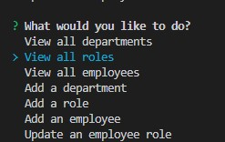

# Employee-Tracker

## Description
This program creates and holds a database for an organizations information including employee, department and role information.

## Database
This database allows users to view departments, view roles, view employees, add a department, add a role, add an employee, or update an employee. This meets the folling user story:

AS A business owner

I WANT to be able to view and manage the departments, roles, and employees in my company

SO THAT I can organize and plan my business

Here is an example:

## Example of Use
 [Here](https://drive.google.com/file/d/1EJubq5q70dWghTAwyoYCh2zMHICRqzjN/view) is a video showing the site in action.

## Built With
This program the following:
* Javascript (inquirer, mysql2, cTable)